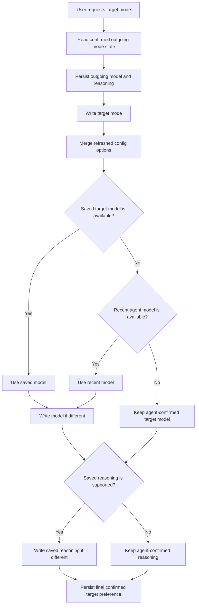
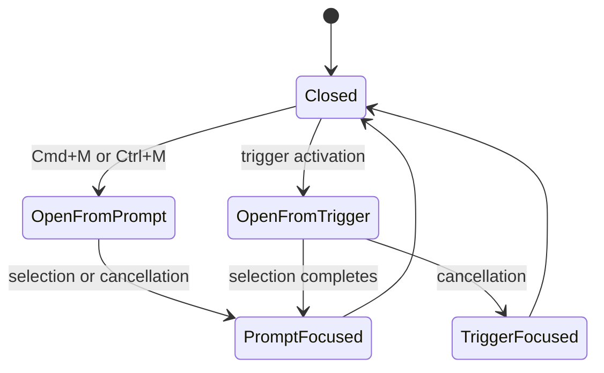

# Design

## Context

See `proposal.md` for motivation and `specs/session-mode-preferences/spec.md` for observable behavior.

The frontend currently has three related but separate forms of state:

- The new-session composer keeps one global `launchModelId`, while recent models are already persisted per agent.
- Loaded sessions keep confirmed config options and a separately reconstructed model selection in memory, scoped by agent and session.
- All config writes for a session are serialized, but a mode write and the model/reasoning writes that restore the target mode are not represented as one semantic transition.

ACP agents may return either a full config-option list or only options relevant to the write. A mode change may also select agent defaults before the desktop can restore user preferences. Therefore, a mode response is authoritative for what the agent currently has, but its temporary model/reasoning values must not overwrite a previously saved target-mode preference during a desktop-initiated transition.

The picker is a modal child of the composer. Bits UI currently restores focus to the model trigger on every close, while the Tab mode shortcut is intentionally handled only by the prompt textarea.

## Goals / Non-Goals

**Goals:**

- Represent confirmed model and reasoning preferences by agent, session, and mode.
- Persist those preferences defensively in desktop local storage.
- Make a user mode change an ordered, session-scoped operation that restores target-mode preferences.
- Keep initial session load agent-authoritative and free from automatic config writes.
- Derive new-session and unseen-mode model defaults from agent-scoped recent use.
- Make model-picker focus restoration preserve the prompt keyboard workflow.

**Non-Goals:**

- Synchronizing preferences through ACP, QueryMT servers, or multiple desktops.
- Changing ACP request or response formats.
- Persisting profile, target, delivery mode, or arbitrary session config options per mode.
- Replacing agent-provided launch mode metadata once such metadata becomes available.
- Guessing an unavailable model identity from provider/model similarity; selection keys, including mesh-node identity, remain exact.

## Decisions

### 1. Store versioned preferences by agent, session, and mode

Add a dedicated local-storage document rather than extending recent-model history:

```ts
type SessionModePreferenceDocument = {
  version: 1;
  agents: Record<string, {
    sessions: Record<string, {
      modes: Record<string, {
        modelId?: string;
        reasoningId?: string;
      }>;
      updatedAt: string;
    }>;
  }>;
};
```

`modelId` is the existing model selection key, not merely the ACP model id, so local and mesh copies remain distinct. Missing fields mean "not learned yet" rather than an empty selection. Loaders validate the document shape and discard malformed entries without preventing application startup. Persistence failures leave the confirmed in-memory state usable.

Preferences are written only from confirmed state:

- after an explicit model or reasoning write succeeds;
- after an authoritative config notification outside a desktop-initiated mode transition; or
- when an existing session load establishes the active mode's current configuration.

Deleting a session removes its persisted mode entries. No migration from existing data is needed because no equivalent per-mode state exists.

Alternative considered: store preferences on the server or in ACP metadata. This would synchronize across clients, but it expands the protocol and ownership model beyond the selected desktop-local scope.

Alternative considered: keep preferences only in memory. This avoids storage migration but fails the restart requirement.

### 2. Maintain a merged confirmed config snapshot per session

Treat each ACP response as a patch by option id when it omits unrelated options, while still accepting complete replacement snapshots from session load. Keep the separately reconstructed model selection for mesh identity, and track the confirmed active mode independently so a model-only response cannot make the current mode unknown.

The merged snapshot is the only source used to capture outgoing preferences. Requested values are never persisted optimistically. A rejected request therefore cannot become either a mode preference or recent-model default.

Alternative considered: continue replacing the full option array after every response. This is simpler, but partial mode/model responses can erase the mode or reasoning option needed to attribute a confirmed value to the correct preference key.

### 3. Introduce a semantic mode-transition operation

Route mode changes from the session composer through a store operation dedicated to mode switching. Existing low-level config writes remain serialized per session, and the complete transition joins that same session-scoped queue so another rapid mode request cannot observe intermediate state.



A per-session transition context identifies the target mode while intermediate responses and notifications arrive. Those updates still refresh confirmed runtime state, but they do not overwrite the saved target preference until restoration finishes. On failure, the transition stops, reports the error, and captures only values actually confirmed by the agent. Previously saved values remain available for a later retry.

The model write precedes reasoning because model selection can change the reasoning choices exposed by an agent. Reasoning is validated against the latest choices after the model response, not only those returned by the mode response.

Alternative considered: let the UI issue mode, model, and reasoning writes independently. This cannot reliably serialize rapid transitions or distinguish temporary agent defaults from final user preferences.

Alternative considered: ignore model metadata returned by a mode response. That preserves the old visual selection but misrepresents the agent's actual state if restoration fails.

### 4. Resolve defaults through existing agent-scoped recent history

Reuse `recentModelsByAgent` as the recency authority. A successful explicit model write moves its exact selection key to the front. Restoring a saved preference during mode switching does not change recency merely because the user visited a mode.

Replace the single global launch model with agent-scoped launch selections, or an equivalent accessor whose value is always resolved for the selected agent. When a catalog is loaded or refreshed:

1. Keep an explicit launch selection if it is still available.
2. Otherwise select the first available entry from that agent's recent history.
3. Otherwise use the catalog default.

A newly created session captures this resolved launch selection and applies it after mode setup, preserving the existing mode-before-model ordering. After the model write succeeds, it becomes both the session-mode preference for the launch mode and the agent's recent model.

Alternative considered: persist one preferred model separate from recent history. The first recent entry already expresses the required ordering, so another preference source would create reconciliation rules without adding behavior.

### 5. Make picker close focus depend on origin and outcome

The model picker tracks whether it opened from the prompt shortcut or its trigger, plus whether a selection completed. The composer supplies a prompt-focus callback; the picker does not query the DOM globally.



The existing coarse-pointer/small-screen guard remains authoritative: when programmatic prompt focus is disabled, the dialog library may use its safe default rather than forcing the virtual keyboard open.

Alternative considered: always restore the prompt. This improves the keyboard path but violates conventional dialog focus behavior for users who opened and dismissed the picker from its trigger.

### 6. Consume Tab only when mode cycling can succeed

Refactor mode cycling to return whether it selected a next value. For existing sessions, it uses the confirmed mode option and refuses while that option is pending. For new sessions, it cycles the launch mode list through the launch-mode callback. The key handler calls `preventDefault()` only when at least two choices exist and a next mode was requested.

This preserves standard keyboard navigation when mode switching is unavailable while keeping focus in the prompt after a valid cycle.

## Risks / Trade-offs

- [Local storage can contain stale session entries] -> Remove entries on successful session deletion, keep the schema versioned, and keep each entry small. Revisit bounded pruning only if storage growth becomes measurable.
- [Partial ACP responses can be mistaken for complete state] -> Distinguish load snapshots from config-write/update patches and merge patches by option id.
- [Unsolicited notifications can race a desktop mode transition] -> Track transition ownership per session and defer preference capture until the transition settles while continuing to update confirmed UI state.
- [A model change can alter reasoning choices] -> Resolve and apply reasoning only after the final model response has been merged.
- [A saved mesh model may refer to an offline node] -> Require an exact available selection-key match and fall back through recent available models rather than silently choosing a local copy.
- [Local state differs across desktops by design] -> Keep the storage key and type explicitly desktop-local and never send the preference document through ACP.
- [Focusing the prompt can open a mobile virtual keyboard] -> Retain the composer's existing programmatic-focus eligibility check.

## Migration Plan

1. Ship the version-1 preference loader with empty-state fallback; existing installations begin without per-mode entries.
2. Seed each loaded session's active mode from agent-confirmed state without issuing writes.
3. Continue reading the existing recent-model storage document; no recent-model migration is required.
4. On rollback, the new local-storage key is ignored by older builds. It can remain safely or be removed manually without affecting server sessions.
